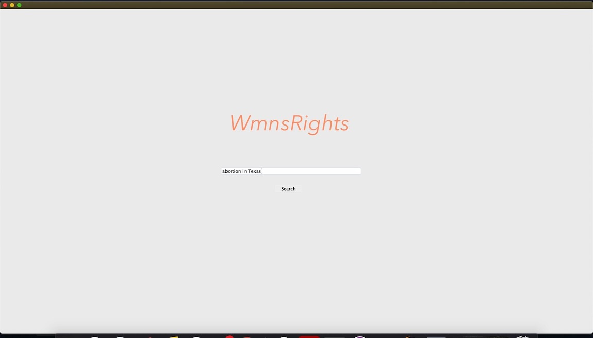
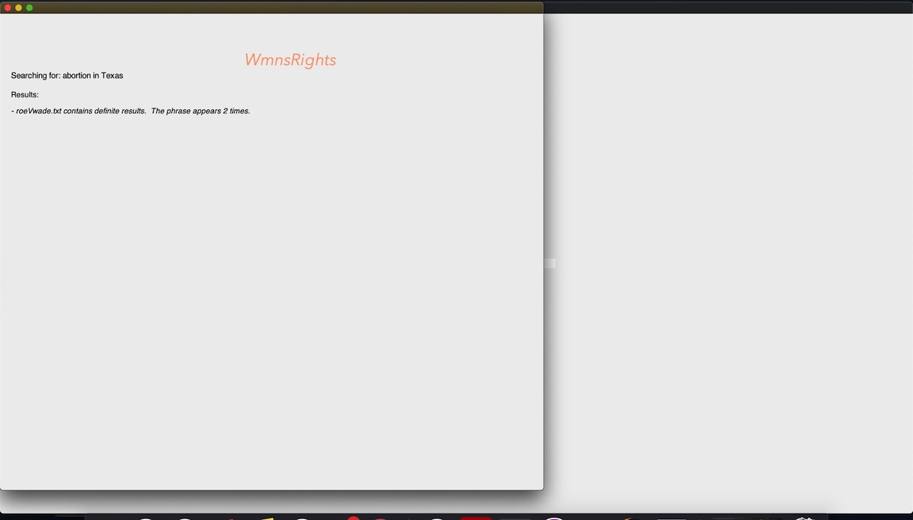
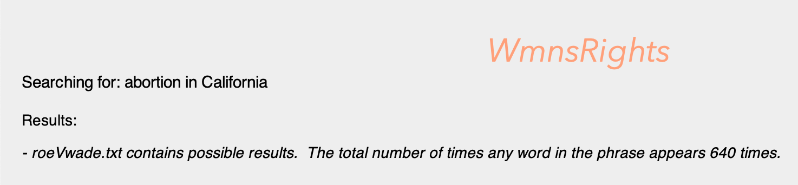
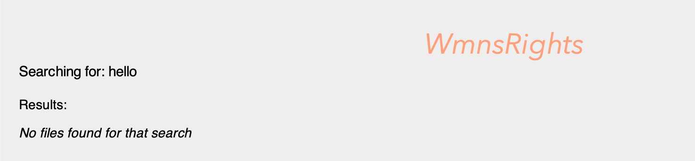

# WmxnsRights

*Work in Progress*
  
WmxnsRights- a search app to help womxn understand and exercise their rights.              

The app  will crawl the Library of Congress' Law Library to provide updated information on womxn's rights. The goal is to give womxn a tool that helps them understand and exercise their rights, especially as it pertains to their health and careers.

Current Goals: Create basic search framework, GUI, return search results
Current functionality: The program searches a .txt file, roeVwade.txt for a user-entered string in a GUI window. A new window will populate when the search is complete to display the results. 

Next steps: -Improve the search algorithims
            -Improve the appearance of the GUI
            -Create the crawler

Future Direction: 

1. Use NLP library to refine searches to understand law and articles that deal with the intersection of gender and ethnic, religious, and/or economic discrimination.

2. Improve GUI appearance

3. Expand crawler to sites other than the LOC Law Library

4. Add an online discussion platform

MavenDependencies: jsoup1.13.1.jar

Classes:
  WmxnsRights - contains main(), call the initial window to start the app
  CreateFrame - contains functions to automate all objects needed for each frame
  DisplayGUI extends CreateFrame - creates the initial window where the user can enter the search
  UserInterface extends CreateFrame - creates all new windows (currently, just the search results window)
  Crawler - will contain crawler to search the Law Library (currently, just opens the file)
  ResultsFound extends Crawler - containts the functions needed to parse and search the file with Scanner()
  Database - for a future long-term database (currently, empty -> ignore)
